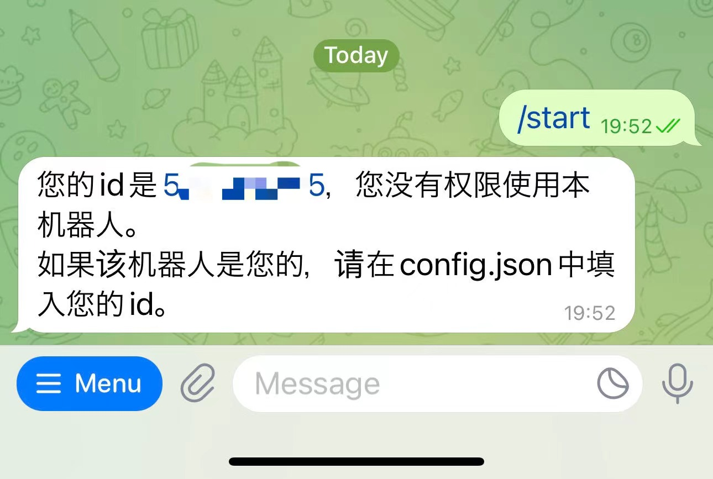

# 一个北航博雅课程 TelegramBot

v0.1

## 介绍

虽然博雅选课系统升级了，官方曾说提供提醒功能，但是实际上一点也不好用，于是还是得自己写一个。

## 功能

- [x] 查询当前可选课程
- [x] 查看已选课程
- [x] 查看课程详情
- [x] 选课
- [x] 退课
- [x] 开放预选课程时发送通知
- [x] 预约自动选择暂未开放课程
- [x] 自动轮询补选他人退选课程
- [ ] 配置抢课频率，轮询周期等等可配置项
- [ ] 上课前发送提醒
- [ ] 根据时间地点等条件自动选课，要求用户在退课截止日期之前确认，否则自动退课

## 非功能约束

- [x] 使用高效的asyncio异步编程，减少线程创建和切换开销
- [x] 仅供私人使用，机器人拒绝他人访问
- [x] 断线重连后不丢失新课程通知
- [x] API调用异常后重新尝试或重新登录
- [x] 安装和使用说明

## 安装使用方法

安装 Python 环境，Python 版本 >= 3.7 已测试

安装依赖软件包：`pip install -r requirements.txt -i https://pypi.tuna.tsinghua.edu.cn/simple`

在 Telegram 中找到 @BotFather ，向他发送`/newbot`并跟随指引创建bot，记录下token

创建文件夹`data`和配置文件`data/config.json`，内容如下：

```json
{
    "user_agent": "Mozilla/5.0 (Macintosh; Intel Mac OS X 10_15_7) AppleWebKit/537.36 (KHTML, like Gecko) Chrome/98.0.4758.109 Safari/537.36",
    "bykc_root": "https://bykc.buaa.edu.cn/sscv",
    "sso_username": "你的统一认证学号",
    "sso_password": "你的统一认证密码",
    "telegram_token": "你在@BotFather处获取的token",
    "proxy_path": "若使用代理则填入，形如http://127.0.0.1:8080，否则填空串",
    "telegram_owner_id": "你的telegram id，可以先不填，运行后找机器人要"
}
```

注：若代理填入空串则你仍需保证你的设备可以连接到Telegram服务器。

开始运行机器人`python src/main.py`

在telegram中联系你的机器人并发送`/start`，若提示无权限则将id填入配置文件并重启。




## 演示


